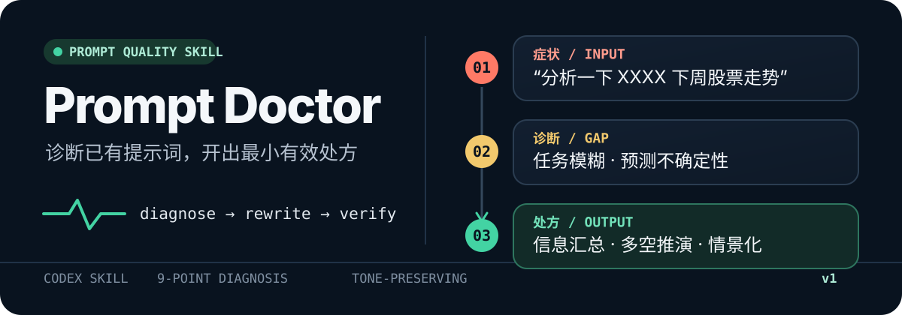

<p align="center">
  
</p>

<p align="center">
  把“不对味”的已有提示词，改成更清楚、更可执行的版本。
</p>

<p align="center">
  <a href="./SKILL.md">技能说明</a> ·
  <a href="./references/checklist.md">9 项诊断</a> ·
  <a href="./references/examples.md">前后对照</a>
</p>

## 一眼看懂

**原始提示词**

```text
根据我贴的财报，告诉我这家公司未来一年股价能涨多少。
```

**诊断**

这是判断 / 预测型任务，缺背景、模式和验收标准，也把复杂判断写成了单点答案。仅凭财报不能可靠预测一年后的股价，适合改成信息汇总、多空推演和情景化分析。

**Prompt Doctor 的处方**

```text
以谨慎的基本面分析师视角，基于我贴的财报，评估这家公司未来一年的上行空间。不要给“必涨多少”的单点预测，把结论写成条件化情景。

背景：
- 公司名称 / 股票代码：[填写]
- 财报期间：[填写]
- 当前股价及日期：[填写]

分五步：
1. 信息汇总：提取营收、利润、现金流、负债、增长和管理层指引；财报里没有的信息标“需补充”，不要猜。
2. 多空推演：分别给出 3 条最强的看多与看空逻辑，每条写清依据、关键假设和证伪信号。
3. 交叉反驳：让多方逐条回应空方，空方再逐条回应多方，找出证据最弱的论点。
4. 关键假设：列出最影响估值的 3 个假设，并说明假设变化会怎样影响结论。
5. 情景化：给出乐观 / 中性 / 悲观三种情景，各自包含触发条件、合理估值区间和相对当前价的潜在涨跌幅，不合并成一个伪精确百分比。

先完成第 1 步，输出后停下来等我确认，再继续后面的步骤。
```

**说明**：原意仍然是评估一年上行空间，但从“直接报一个数字”改成了可分步验证的判断过程。

**预警**：优化 prompt 也不能让 AI 准确预测未来股价；这份处方提供的是条件化情景，不是收益保证。

## 它会做什么

- **9 项诊断**：角色、背景、任务、模式、受众、约束、示例、验收和负向约束。
- **任务分类**：区分成品型与思考型、单轮与多步，决定使用变体 A 还是变体 B。
- **先取材再提问**：优先使用当前会话和项目材料，只有用户才知道的信息才留空或提问。
- **保留原意和语气**：简单任务只补缺口，复杂判断任务才做结构化升级。
- **复诊与预警**：根据实际输出只补主要缺口；对 AI 本质做不好的任务直接换用法。

## 工作方式

```text
已有 prompt
    ↓
9 项检查表诊断缺口
    ↓
成品型 / 思考型 · 单轮 / 多步
    ↓
从当前上下文取材
    ↓
变体 A 最小升级 / 变体 B 结构化升级
```

默认输出顺序：**诊断 → 变体 → 说明 → 预警（如适用）**。

## 安装

将仓库克隆到 Codex 可发现的技能目录：

```bash
git clone https://github.com/cybercyrus-gh/prompt-doctor.git \
  ~/.agents/skills/prompt-doctor
```

更新已有安装：

```bash
git -C ~/.agents/skills/prompt-doctor pull --ff-only
```

## 使用

贴上要修的现有提示词：

```text
使用 $prompt-doctor 优化这个 prompt：

帮我写一篇小红书文案介绍咖啡店，要有网感，去 AI 味。
```

也可以拿实际输出回来复诊：

```text
使用 $prompt-doctor 复诊。下面是原 prompt、实际输出和我不满意的地方。
```

适合这些表达：

- “优化这个 prompt”
- “提示词怎么写更好？”
- “AI 输出不对味，帮我回头改指令”
- “只改提示词的这一部分，其他别动”

不用于从零代写全新 prompt、直接优化代码或文案本身，以及 Agent system prompt 深度工程。

## 三条护栏

1. **不过度工程化**：简单任务不给 500 字模板。
2. **不加做不到的约束**：把“保证准确”等要求改成标注不确定处和待核实项。
3. **保留用户语气**：优化提示词，不擅自改变用户真正想做的事。

原版还定义了案例生长机制：遇到有代表性的真实反馈或新模式时，可把案例追加到 `references/examples.md`；超过 10 条时先修剪同类案例。

## 仓库结构

```text
prompt-doctor/
├── README.md                 # GitHub 项目首页
├── SKILL.md                  # 原版工作流，仅修复 frontmatter 兼容性
├── assets/readme/hero.svg    # README 视觉标题
└── references/
    ├── checklist.md          # 原版 9 项诊断清单
    ├── rewrites.md           # 原版 8 类重写动作
    └── examples.md           # 原版前后对照示例
```

README 和 `assets/readme/` 只负责 GitHub 展示；技能行为以 `SKILL.md` 和 `references/` 为准。技能 frontmatter 已通过 `skill-creator` 的结构校验。
